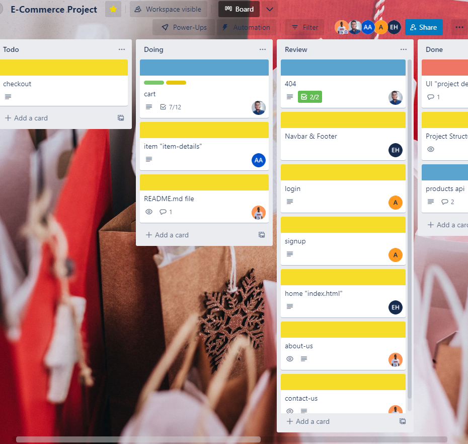

# Ostore

Team #1's e-commerce project that made using JS.

### Key Features

- User can login or signup.
- User can preview 5 categories.
- Details page for each item exists in the store.
- Only loggedin users can add items to cart, and buy items.

### Snapshot of Trello

---

### Team Roles

- ##### Esraa Hussein

  - Working on Homepage, Categories pages & Navbar, Footer
  - Practiced on: Bootstrap, CSS, HTML, JS, Fetching products from an API, Storing and getting data using localStorage, Filtering, ForEach, Debugging using console.log(), Git, and Github

- ##### Ahmed Mohamed Hassan

  - Working on Login, Signup pages
  - Practiced on: Bootstrap, Form validation using regex, Styling Form errors, LocalStorage, SessionStorage, Handling object error in case was null, Git, and Github

- ##### Abdelrahman Mahmoud

  - Finding an API
  - Working on Cart, Checkout, 404 pages
  - Practiced on: Bootstrap, LocalStorage, SessionStorage, JavaScript, Filtering data, Handling object error in case was null, Git, and Github

- ##### Abdelrahman Mohamed Moussa

  - Working on Item-details page
  - Practiced on: HTML, CSS, JS, LocalStorage, SessionStorage, Git, and Github

- ##### Mohamed Idris
  - Working on About, Contact pages
  - Supporting the team in case of stuck
  - Practiced on: Project Structuring, Creating workspace on Trello, Thinking as a fullstack developer, Git, and Github

##### Used API: [https://dummyjson.com/products](https://dummyjson.com/products)
